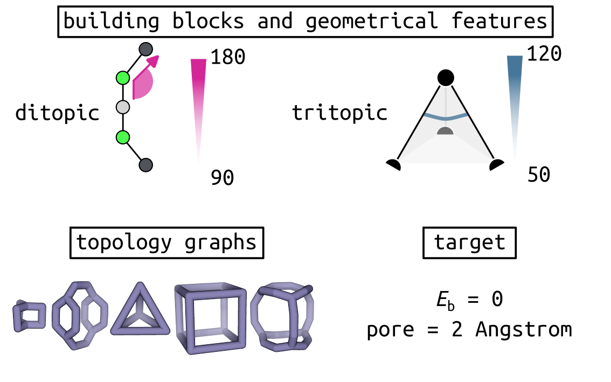
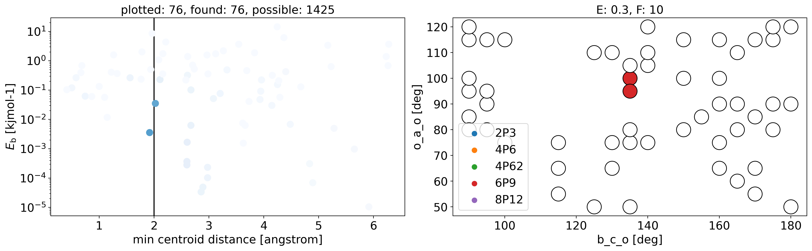

Minimal model genetic algorithm
===============================

In this recipe, I will perform genetic algorithm-based optimisation of minimal
models of ditopic and tritopic building blocks and targetting a pore size of 2
Angstrom. The optimisation is over the building block angles, and cage
topology graph.

We first define a chromosome of one pair of building blocks, with a range of
forcefield parameters and multiple topology graph choices.

.. testcode:: recipe1-test
    :hide:

    import stk
    import stko
    import cgexplore as cgx
    import logging
    import pathlib
    import numpy as np

    logger = logging.getLogger(__name__)

    # Define a working directory.
    wd = pathlib.Path.cwd() / "source"/ "recipes" / "recipe_1_output"
    struct_output = wd / "structures"
    calc_dir = wd / "calculations"
    data_dir = wd / "data"
    figure_dir = wd / "figures"

.. testcode:: recipe1-test

    # Define a database, and a prefix for naming structure, forcefield and
    # output files.
    prefix = "opt"
    database_path = data_dir / "test.db"
    database = cgx.utilities.AtomliteDatabase(database_path)

    # Define beads.
    bead_library = cgx.molecular.BeadLibrary.from_bead_types(
        # Type and coordination.
        {"a": 3, "b": 2, "c": 2, "o": 2}
    )

    # Define the chromosome generator, holding all the changeable genes.
    chromo_it = cgx.systems_optimisation.ChromosomeGenerator(
        prefix=prefix,
        present_beads=bead_library.get_present_beads(),
        vdw_bond_cutoff=2,
    )
    chromo_it.add_gene(
        iteration=(
            ("2P3", stk.cage.TwoPlusThree),
            ("4P6", stk.cage.FourPlusSix),
            ("4P62", stk.cage.FourPlusSix2),
            ("6P9", stk.cage.SixPlusNine),
            ("8P12", stk.cage.EightPlusTwelve),
        ),
        gene_type="topology",
    )
    # Set some basic building blocks up. This should be run by an algorithm
    # later.
    chromo_it.add_gene(
        iteration=(
            cgx.molecular.TwoC1Arm(
                bead=bead_library.get_from_type("b"),
                abead1=bead_library.get_from_type("c"),
            ),
        ),
        gene_type="precursor",
    )
    chromo_it.add_gene(
        iteration=(
            cgx.molecular.ThreeC1Arm(
                bead=bead_library.get_from_type("a"),
                abead1=bead_library.get_from_type("o"),
            ),
        ),
        gene_type="precursor",
    )

    definer_dict = {
        # Bonds.
        "ao": ("bond", 1.5, 1e5),
        "bc": ("bond", 1.5, 1e5),
        "co": ("bond", 1.0, 1e5),
        "cc": ("bond", 1.0, 1e5),
        "oo": ("bond", 1.0, 1e5),
        # Angles.
        "ccb": ("angle", 180.0, 1e2),
        "ooc": ("angle", 180.0, 1e2),
        "occ": ("angle", 180.0, 1e2),
        "ccc": ("angle", 180.0, 1e2),
        "oco": ("angle", 180.0, 1e2),
        "aoc": ("angle", 180.0, 1e2),
        "aoo": ("angle", 180.0, 1e2),
        "bco": ("angle", tuple(i for i in range(90, 181, 5)), 1e2),
        "cbc": ("angle", 180.0, 1e2),
        "oao": ("angle", tuple(i for i in range(50, 121, 5)), 1e2),
        # Torsions.
        "ocbco": ("tors", "0134", 180, 50, 1),
        # Nonbondeds.
        "a": ("nb", 10.0, 1.0),
        "b": ("nb", 10.0, 1.0),
        "c": ("nb", 10.0, 1.0),
        "o": ("nb", 10.0, 1.0),
    }
    chromo_it.add_forcefield_dict(definer_dict=definer_dict)

.. testcode:: recipe1-test
    :hide:

    def fitness_function(  # noqa: PLR0913
        chromosome: cgx.systems_optimisation.Chromosome,
        chromosome_generator: cgx.systems_optimisation.ChromosomeGenerator,
        database_path: pathlib.Path,
        calculation_output: pathlib.Path,
        structure_output: pathlib.Path,
        options: dict,  # noqa: ARG001
    ) -> float:
        """Calculate fitness."""
        database = cgx.utilities.AtomliteDatabase(database_path)
        target_pore = 2
        name = f"{chromosome.prefix}_{chromosome.get_separated_string()}"
        entry = database.get_entry(name)
        return entry.properties["fitness"]

    def structure_function(
        chromosome: cgx.systems_optimisation.Chromosome,
        database_path: pathlib.Path,
        calculation_output: pathlib.Path,
        structure_output: pathlib.Path,
        options: dict,  # noqa: ARG001
    ) -> None:
        """Geometry optimisation."""
        database = cgx.utilities.AtomliteDatabase(database_path)
        name = f"{chromosome.prefix}_{chromosome.get_separated_string()}"
        if not database.has_molecule(name):
            assert False

Now we can define the genetic algorithm:

.. testcode:: recipe1-test

    # Define fitness calculator.
    fitness_calculator = cgx.systems_optimisation.FitnessCalculator(
        # Not showing this, as in the docs, we have skipped steps, but the
        # downloadable script has it all!
        fitness_function=fitness_function,
        chromosome_generator=chromo_it,
        structure_output=struct_output,
        calculation_output=calc_dir,
        database_path=database_path,
        options={},
    )

    # Define structure calculator.
    structure_calculator = cgx.systems_optimisation.StructureCalculator(
        # Not showing this, as in the docs, we have skipped steps, but the
        # downloadable script has it all!
        structure_function=structure_function,
        structure_output=struct_output,
        calculation_output=calc_dir,
        database_path=database_path,
        options={},
    )

    # This is a very short run for testing sake, but modify these settings
    # for further exploration.
    seeds = [4]
    num_generations = 10
    selection_size = 5
    num_processes = 1
    num_to_operate = 2
    for seed in seeds:
        generator = np.random.default_rng(seed)

        initial_population = chromo_it.select_random_population(
            generator,
            size=selection_size,
        )

        # Yield this.
        generations = []
        generation = cgx.systems_optimisation.Generation(
            chromosomes=initial_population,
            fitness_calculator=fitness_calculator,
            structure_calculator=structure_calculator,
            num_processes=num_processes,
        )

        generation.run_structures()
        _ = generation.calculate_fitness_values()
        generations.append(generation)

        for generation_id in range(1, num_generations + 1):
            logger.info("doing generation %s of seed %s", generation_id, seed)
            logger.info(
                "initial size is %s.", generation.get_generation_size()
            )
            logger.info("doing mutations.")
            merged_chromosomes = []
            merged_chromosomes.extend(
                chromo_it.mutate_population(
                    chromosomes={
                        f"{chromosome.prefix}"
                        f"_{chromosome.get_separated_string()}": chromosome
                        for chromosome in generation.chromosomes
                    },
                    generator=generator,
                    gene_range=chromo_it.get_term_ids(),
                    selection="random",
                    num_to_select=num_to_operate,
                    database=database,
                )
            )
            merged_chromosomes.extend(
                chromo_it.mutate_population(
                    chromosomes={
                        f"{chromosome.prefix}"
                        f"_{chromosome.get_separated_string()}": chromosome
                        for chromosome in generation.chromosomes
                    },
                    generator=generator,
                    gene_range=chromo_it.get_topo_ids(),
                    selection="random",
                    num_to_select=num_to_operate,
                    database=database,
                )
            )
            merged_chromosomes.extend(
                chromo_it.mutate_population(
                    chromosomes={
                        f"{chromosome.prefix}"
                        f"_{chromosome.get_separated_string()}": chromosome
                        for chromosome in generation.chromosomes
                    },
                    generator=generator,
                    gene_range=chromo_it.get_prec_ids(),
                    selection="random",
                    num_to_select=num_to_operate,
                    database=database,
                )
            )
            merged_chromosomes.extend(
                chromo_it.mutate_population(
                    chromosomes={
                        f"{chromosome.prefix}"
                        f"_{chromosome.get_separated_string()}": chromosome
                        for chromosome in generation.chromosomes
                    },
                    generator=generator,
                    gene_range=chromo_it.get_term_ids(),
                    selection="roulette",
                    num_to_select=num_to_operate,
                    database=database,
                )
            )
            merged_chromosomes.extend(
                chromo_it.mutate_population(
                    chromosomes={
                        f"{chromosome.prefix}"
                        f"_{chromosome.get_separated_string()}": chromosome
                        for chromosome in generation.chromosomes
                    },
                    generator=generator,
                    gene_range=chromo_it.get_topo_ids(),
                    selection="roulette",
                    num_to_select=num_to_operate,
                    database=database,
                )
            )
            merged_chromosomes.extend(
                chromo_it.mutate_population(
                    chromosomes={
                        f"{chromosome.prefix}"
                        f"_{chromosome.get_separated_string()}": chromosome
                        for chromosome in generation.chromosomes
                    },
                    generator=generator,
                    gene_range=chromo_it.get_prec_ids(),
                    selection="roulette",
                    num_to_select=num_to_operate,
                    database=database,
                )
            )

            merged_chromosomes.extend(
                chromo_it.crossover_population(
                    chromosomes={
                        f"{chromosome.prefix}"
                        f"_{chromosome.get_separated_string()}": chromosome
                        for chromosome in generation.chromosomes
                    },
                    generator=generator,
                    selection="random",
                    num_to_select=num_to_operate,
                    database=database,
                )
            )

            merged_chromosomes.extend(
                chromo_it.crossover_population(
                    chromosomes={
                        f"{chromosome.prefix}"
                        f"_{chromosome.get_separated_string()}": chromosome
                        for chromosome in generation.chromosomes
                    },
                    generator=generator,
                    selection="roulette",
                    num_to_select=num_to_operate,
                    database=database,
                )
            )

            # Add the best 5 to the new generation.
            merged_chromosomes.extend(generation.select_best(selection_size=5))

            generation = cgx.systems_optimisation.Generation(
                chromosomes=chromo_it.dedupe_population(merged_chromosomes),
                fitness_calculator=fitness_calculator,
                structure_calculator=structure_calculator,
                num_processes=num_processes,
            )
            logger.info("new size is %s.", generation.get_generation_size())

            # Build, optimise and analyse each structure.
            generation.run_structures()
            _ = generation.calculate_fitness_values()

            # Add final state to generations.
            generations.append(generation)

            # Select the best of the generation for the next generation.
            best = generation.select_best(selection_size=selection_size)
            generation = cgx.systems_optimisation.Generation(
                chromosomes=chromo_it.dedupe_population(best),
                fitness_calculator=fitness_calculator,
                structure_calculator=structure_calculator,
                num_processes=num_processes,
            )
            logger.info("final size is %s.", generation.get_generation_size())

            # Output best structures as images.
            best_chromosome = generation.select_best(selection_size=1)[0]
            best_name = (
                f"{best_chromosome.prefix}_"
                f"{best_chromosome.get_separated_string()}"
            )

        logger.info("top scorer is %s (seed: %s)", best_name, seed)

And now we can analyse the space we have explored (code in the downloadable
file)!

With a top scorer:

.. moldoc::

    import moldoc.molecule as molecule
    import stk
    import pathlib

    try:
        wd = (
            pathlib.Path.cwd()
            / "source"
            / "recipes"
            / "recipe_1_output"
            / "structures"
        )
        structure = stk.BuildingBlock.init_from_file(
            str(wd / "opt_3-0-0-9-9_optc.mol")
        )
    except OSError:
        wd = (
            pathlib.Path.cwd()
            / "recipes"
            / "recipe_1_output"
            / "structures"
        )
        structure = stk.BuildingBlock.init_from_file(
            str(wd / "opt_3-0-0-9-9_optc.mol")
        )

    moldoc_display_molecule = molecule.Molecule(
        atoms=(
            molecule.Atom(
                atomic_number=atom.get_atomic_number(),
                position=position,
            ) for atom, position in zip(
                structure.get_atoms(),
                structure.get_position_matrix(),
            )
        ),
        bonds=(
            molecule.Bond(
                atom1_id=bond.get_atom1().get_id(),
                atom2_id=bond.get_atom2().get_id(),
                order=bond.get_order(),
            ) for bond in structure.get_bonds()
        ),
    )

And we can use chemiscope to explore this map interactively!

.. chemiscope:: recipe_1_output/data/space_explored.json.gz

.. raw:: html

    <a class="btn-download" href="../_static/recipes/recipe_1.py" download>⬇️ Download Python Script</a>
