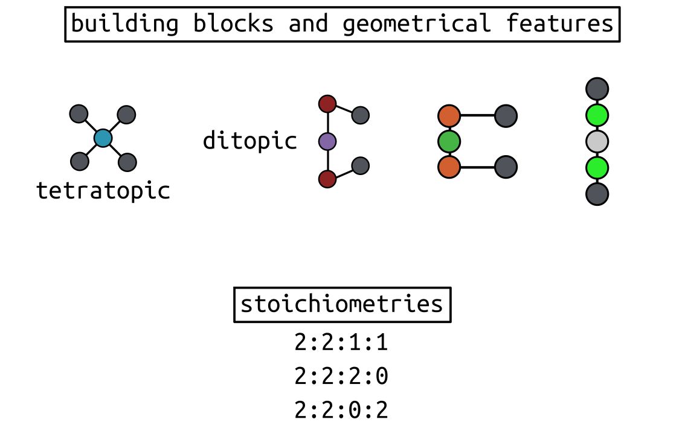
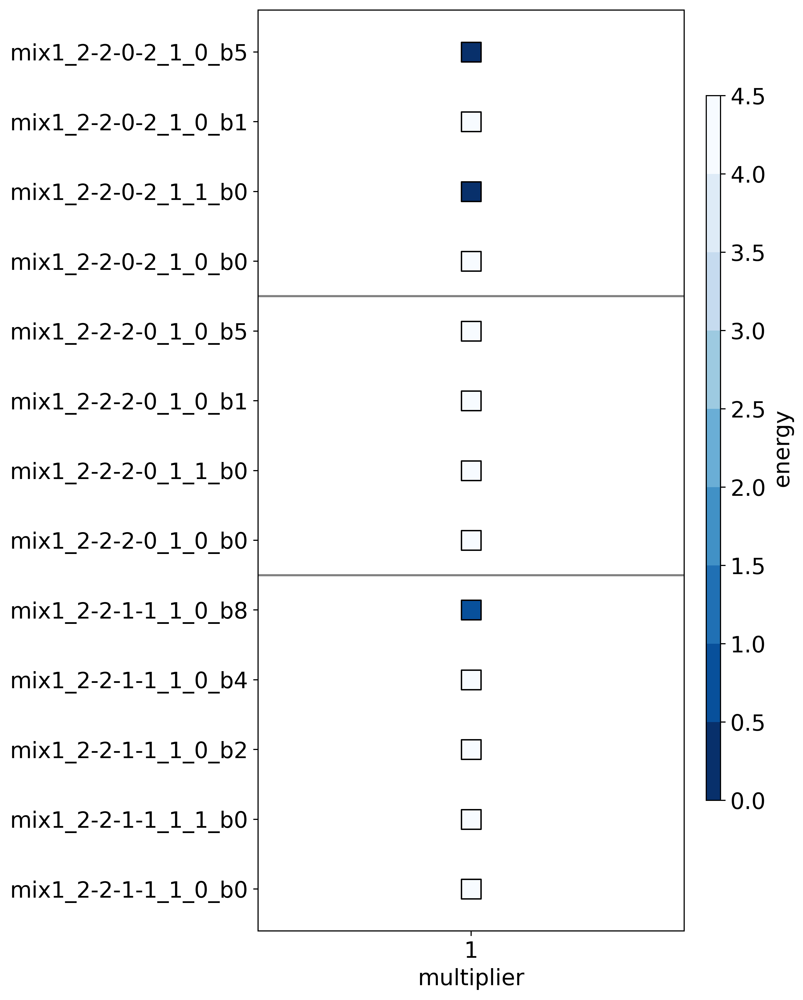

Four component structure prediction
===================================

In this recipe, I will reproduce the prediction of the ``stirrup`` structures
from `this paper <>`_. Using minimal models of ditopic and tetratopic building
blocks, we generated all possible homoleptic and heteroleptic graphs and
building block configurations with ``2:2:1:1``, ``2:2:0:2`` or ``2:2:2:0``
stoichiometries and compute their relative stability, aiming for the most
stable structure. Note that the forcefield is not modified, but defined from
atomistic building blocks.

.. testcode:: recipe5-test
    :hide:

    import stk
    import stko
    import cgexplore as cgx
    import logging
    import pathlib
    import itertools as it

    logger = logging.getLogger(__name__)

    # Define a working directory.
    wd = pathlib.Path.cwd() / "source"/ "recipes" / "recipe_5_output"
    struct_output = wd / "structures"
    calc_dir = wd / "calculations"
    data_dir = wd / "data"
    figure_dir = wd / "figures"
    ligand_dir = wd / "ligands"

    def optimisation_workflow(  # noqa: PLR0913
        config_name: str,
        conformer_db_path: pathlib.Path,
        topology_code: cgx.scram.TopologyCode,
        iterator: cgx.scram.TopologyIterator,
        bb_config: cgx.scram.BuildingBlockConfiguration,
        calculation_dir: pathlib.Path,
        forcefield: cgx.forcefields.ForceField,
    ) -> None:
        """Geometry optimise a configuration."""
        # Fake for the test.
        return

    def analyse_cage(
        database_path: pathlib.Path,
        name: str,
        min_energy_key: str,
        conformer_db_path: pathlib.Path,
    ) -> None:
        """Analyse toy model cage."""
        # Fake for the test.
        return

We will start by defining our ``definer_dict`` for the constant terms, and the
associated bead library.

.. testcode:: recipe5-test

    # Define a database, and a prefix for naming structure, forcefield and
    # output files.
    database_path = data_dir / "test.db"

    # Define a definer dictionary.
    # These are constants, while different systems can override these
    # parameters.
    cg_scale = 2
    constant_definer_dict = {
        # Bonds.
        "mb": ("bond", 1.0, 1e5),
        # Angles.
        "aca": ("angle", 180, 1e2),
        "ede": ("angle", 180, 1e2),
        "mba": ("angle", 180, 1e2),
        "mbe": ("angle", 180, 1e2),
        # Nonbondeds.
        "m": ("nb", 10.0, 1.0),
        "d": ("nb", 10.0, 1.0),
        "e": ("nb", 10.0, 1.0),
        "a": ("nb", 10.0, 1.0),
        "b": ("nb", 10.0, 1.0),
        "c": ("nb", 10.0, 1.0),
        "f": ("nb", 10.0, 1.0),
    }

    # Define beads.
    bead_library = cgx.molecular.BeadLibrary.from_bead_types(
        # Type and coordination.
        {"m": 4, "a": 2, "b": 2, "c": 2, "d": 2, "e": 2, "f": 2}
    )

Then we can map that to our building block library.

.. testcode:: recipe5-test

    # Define your forcefield alterations as building blocks.
    building_block_library = {
        "lin": {
            "precursor": cgx.molecular.TwoC1Arm(
                bead=bead_library.get_from_type("c"),
                abead1=bead_library.get_from_type("a"),
            ),
            "mod_definer_dict": {
                "ba": ("bond", 2.8 / cg_scale, 1e5),
                "ac": ("bond", 1.5 / 2 / cg_scale, 1e5),
                "bac": ("angle", 180, 1e2),
            },
        },
        "mxy": {
            "precursor": cgx.molecular.TwoC1Arm(
                bead=bead_library.get_from_type("d"),
                abead1=bead_library.get_from_type("e"),
            ),
            "mod_definer_dict": {
                "be": ("bond", 7.6 / cg_scale, 1e5),
                "ed": ("bond", 5.0 / 2 / cg_scale, 1e5),
                "bed": ("angle", 90, 1e2),
            },
        },
        "tetra": {
            "precursor": cgx.molecular.FourC1Arm(
                bead=bead_library.get_from_type("m"),
                abead1=bead_library.get_from_type("b"),
            ),
            "mod_definer_dict": {
                "mb": ("bond", 2.0 / cg_scale, 1e5),
                "bmb": ("pyramid", 90, 1e2),
            },
        },
        "corner": {
            "precursor": cgx.molecular.TwoC0Arm(
                bead=bead_library.get_from_type("f"),
            ),
            "mod_definer_dict": {
                "bf": ("bond", 2.0 / cg_scale, 1e5),
                "bfb": ("angle", 90, 1e2),
                "fbm": ("angle", 90, 1e2),
            },
        },
    }

And define a series of systems to explore. Here, I only check particular
homoleptic and heteroleptic combinations.

.. testcode:: recipe5-test

    # Define systems to predict the structure of.
    systems = {
        "mix1_2-2-1-1": {
            "stoichiometry_map": {"tetra": 2, "corner": 2, "lin": 1, "mxy": 1},
            "multipliers": (1,),
            "vdw_cutoff": 2,
        },
        "mix1_2-2-2-0": {
            "stoichiometry_map": {"tetra": 2, "corner": 2, "lin": 2},
            "multipliers": (1,),
            "vdw_cutoff": 2,
        },
        "mix1_2-2-0-2": {
            "stoichiometry_map": {"tetra": 2, "corner": 2, "mxy": 2},
            "multipliers": (1,),
            "vdw_cutoff": 2,
        },
    }

Time to iterate!

.. testcode:: recipe5-test

    for system_name, syst_d in systems.items():
        logger.info("doing system: %s", system_name)
        # Merge constant dict with modifications from different systems.
        merged_definer_dicts = cgx.systems_optimisation.merge_definer_dicts(
            original_definer_dict=constant_definer_dict,
            new_definer_dicts=[
                building_block_library[i]["mod_definer_dict"]
                for i in syst_d["stoichiometry_map"]
            ],
        )

        forcefield = cgx.systems_optimisation.get_forcefield_from_dict(
            identifier=f"{system_name}ff",
            prefix=f"{system_name}ff",
            vdw_bond_cutoff=syst_d["vdw_cutoff"],
            present_beads=bead_library.get_present_beads(),
            definer_dict=merged_definer_dicts,
        )

        # Build all the building blocks and pre optimise their structures.
        bb_map = {}
        for prec_name in syst_d["stoichiometry_map"]:
            prec = building_block_library[prec_name]["precursor"]
            if prec_name == "corner":
                bb = prec.get_building_block()
            else:
                bb = cgx.utilities.optimise_ligand(
                    molecule=prec.get_building_block(),
                    name=f"{system_name}_{prec.get_name()}",
                    output_dir=calc_dir,
                    forcefield=forcefield,
                    platform=None,
                ).clone()
                bb.write(
                    str(
                        ligand_dir
                        / f"{system_name}_{prec.get_name()}_optl.mol"
                    )
                )
            bb_map[prec_name] = bb

        for multiplier in syst_d["multipliers"]:
            logger.info(
                "doing system: %s, multi: %s", system_name, multiplier
            )

            # Automate the graph type naming.
            graph_type = cgx.scram.generate_graph_type(
                stoichiometry_map=syst_d["stoichiometry_map"],
                multiplier=multiplier,
                bb_library=bb_map,
            )

            # Define a connectivity based on a multiplier.
            iterator = cgx.scram.TopologyIterator(
                building_block_counts={
                    bb_map[name]: stoich * multiplier
                    for name, stoich in syst_d["stoichiometry_map"].items()
                },
                graph_type=graph_type,
                graph_set="rxx",
            )
            logger.info(
                "graph iteration has %s graphs", iterator.count_graphs()
            )

            possible_bbdicts = cgx.scram.get_custom_bb_configurations(
                iterator=iterator
            )
            logger.info(
                "building block iteration has %s options",
                len(possible_bbdicts),
            )

            logger.info(
                "iterating over %s graphs and bb configurations...",
                iterator.count_graphs() * len(possible_bbdicts),
            )
            run_topology_codes = []
            for bb_config, (idx, topology_code) in it.product(
                possible_bbdicts,
                enumerate(iterator.yield_graphs()),
            ):
                # Filter graphs for 1-loops.
                if topology_code.contains_parallels():
                    continue

                if not cgx.scram.passes_graph_bb_iso(
                    topology_code=topology_code,
                    bb_config=bb_config,
                    run_topology_codes=run_topology_codes,
                ):
                    continue

                run_topology_codes.append((topology_code, bb_config))

                # Here we apply a multi-initial state, multi-step geometry
                # optimisation algorithm.
                config_name = (
                    f"{system_name}_{multiplier}_{idx}_b{bb_config.idx}"
                )
                # Each conformer is stored here.
                conformer_db_path = calc_dir / f"{config_name}.db"
                optimisation_workflow(
                    config_name=config_name,
                    conformer_db_path=conformer_db_path,
                    topology_code=topology_code,
                    iterator=iterator,
                    bb_config=bb_config,
                    calculation_dir=calc_dir,
                    forcefield=forcefield,
                )

                conformer_db = cgx.utilities.AtomliteDatabase(
                    conformer_db_path
                )
                min_energy_structure = None
                min_energy = float("inf")
                min_energy_key = None
                for entry in conformer_db.get_entries():
                    if entry.properties["energy_per_bb"] < min_energy:
                        min_energy = entry.properties["energy_per_bb"]
                        min_energy_structure = conformer_db.get_molecule(
                            key=entry.key
                        )
                        min_energy_key = entry.key

                # To file.
                min_energy_structure.write(
                    str(struct_output / f"{config_name}_optc.mol")
                )

                # To database.
                cgx.utilities.AtomliteDatabase(database_path).add_molecule(
                    molecule=min_energy_structure, key=config_name
                )
                properties = {
                    "multiplier": multiplier,
                    "topology_idx": idx,
                }
                cgx.utilities.AtomliteDatabase(database_path).add_properties(
                    key=config_name, property_dict=properties
                )

                analyse_cage(
                    database_path=database_path,
                    name=config_name,
                    conformer_db_path=conformer_db_path,
                    min_energy_key=min_energy_key,
                )

And now we can plot the most stable structure for each multiplier. graph and
building block configuration combination (different stoichiometries are split
by the horizontal lines). The data shows that the homoleptic structure:
``mix1_2-2-0-2_1_0_b5`` (with the bent ligand) is the most stable (along side
another homoleptic structure with a different graph):

.. moldoc::

    import moldoc.molecule as molecule
    import stk
    import pathlib

    try:
        wd = (
            pathlib.Path.cwd()
            / "source"
            / "recipes"
            / "recipe_5_output"
            / "structures"
        )
        structure = stk.BuildingBlock.init_from_file(
            str(wd / "mix1_2-2-0-2_1_0_b5_optc.mol")
        )
    except OSError:
        wd = (
            pathlib.Path.cwd()
            / "recipes"
            / "recipe_5_output"
            / "structures"
        )
        structure = stk.BuildingBlock.init_from_file(
            str(wd / "mix1_2-2-0-2_1_0_b5_optc.mol")
        )

    moldoc_display_molecule = molecule.Molecule(
        atoms=(
            molecule.Atom(
                atomic_number=atom.get_atomic_number(),
                position=position,
            ) for atom, position in zip(
                structure.get_atoms(),
                structure.get_position_matrix(),
            )
        ),
        bonds=(
            molecule.Bond(
                atom1_id=bond.get_atom1().get_id(),
                atom2_id=bond.get_atom2().get_id(),
                order=bond.get_order(),
            ) for bond in structure.get_bonds()
        ),
    )

While the heteroleptic stirrup (``mix1_2-2-1-1_1_0_b8`` is also stable, but
not as stable. However, the flexibility of the bent ligand and the exchange
reaction to form the heteroleptic can explain this outcome.

.. moldoc::

    import moldoc.molecule as molecule
    import stk
    import pathlib

    try:
        wd = (
            pathlib.Path.cwd()
            / "source"
            / "recipes"
            / "recipe_5_output"
            / "structures"
        )
        structure = stk.BuildingBlock.init_from_file(
            str(wd / "mix1_2-2-1-1_1_0_b8_optc.mol")
        )
    except OSError:
        wd = (
            pathlib.Path.cwd()
            / "recipes"
            / "recipe_5_output"
            / "structures"
        )
        structure = stk.BuildingBlock.init_from_file(
            str(wd / "mix1_2-2-1-1_1_0_b8_optc.mol")
        )

    moldoc_display_molecule = molecule.Molecule(
        atoms=(
            molecule.Atom(
                atomic_number=atom.get_atomic_number(),
                position=position,
            ) for atom, position in zip(
                structure.get_atoms(),
                structure.get_position_matrix(),
            )
        ),
        bonds=(
            molecule.Bond(
                atom1_id=bond.get_atom1().get_id(),
                atom2_id=bond.get_atom2().get_id(),
                order=bond.get_order(),
            ) for bond in structure.get_bonds()
        ),
    )

.. raw:: html

    <a class="btn-download" href="_static/recipes/recipe_5.py" download>⬇️ Download Python Script</a>
