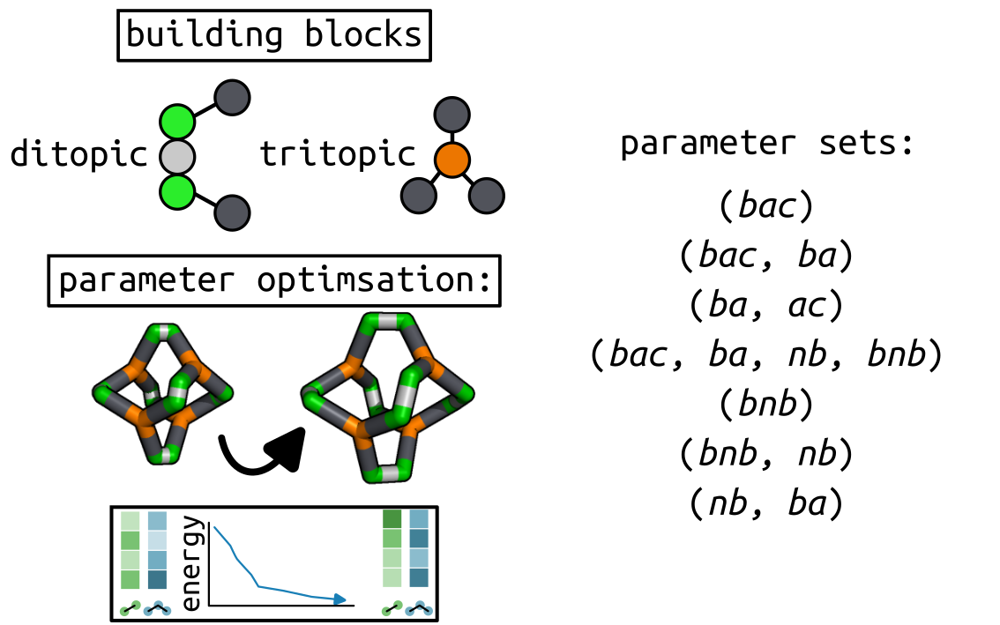
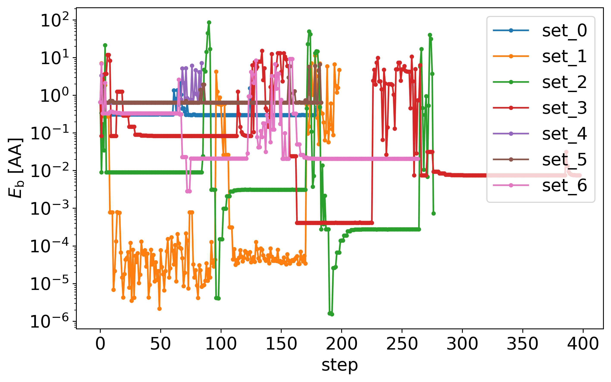
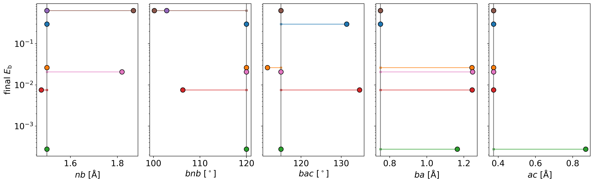

Target optimisation
===================

Here I show the use of the :func:`cgexplore.scram.target optimisation` function
to optimise selected parameters of an input forcefield to minimise the energy
of a provided structure. We have a FourPlusSix cage, that is strained, with
building block parameters coming from the same building blocks in
`recipe 4 <recipe_4.html>`_. We then apply a series of different forcefield
parameter optimisations.

.. testcode:: recipe6-test
    :hide:

    import stk
    import stko
    import cgexplore as cgx
    import logging
    import pathlib

    logger = logging.getLogger(__name__)

    # Define a working directory.
    wd = pathlib.Path.cwd() / "source"/ "recipes" / "recipe_6_output"
    struct_output = wd / "structures"
    calc_dir = wd / "calculations"
    data_dir = wd / "data"
    figure_dir = wd / "figures"
    ligand_dir = wd / "ligands"
    database_path = data_dir / "test.db"

We will start by defining our ``definer_dict`` for the constant terms, and the
associated bead library.

.. testcode:: recipe6-test

    # Define a definer dictionary.
    # These are constants, while different systems can override these
    # parameters.
    cg_scale = 2
    constant_definer_dict = {
        # Bonds.
        "nb": ("bond", 1.0, 1e5),
        # Angles.
        "aca": ("angle", 180, 1e2),
        "nba": ("angle", 180, 1e2),
        # Nonbondeds.
        "n": ("nb", 10.0, 1.0),
        "a": ("nb", 10.0, 1.0),
        "b": ("nb", 10.0, 1.0),
        "c": ("nb", 10.0, 1.0),
    }

    # Define beads.
    bead_library = cgx.molecular.BeadLibrary.from_bead_types(
        # Type and coordination.
        {"n": 3, "a": 2, "b": 2, "c": 2}
    )

I skip this in the recipe, but we can use the same process as
`recipe 2 <recipe_2.html>`_ or `recipe 5 <recipe_5.html>`_ to perform structure
prediction. Here, we still define the building blocks and systems.

.. testcode:: recipe6-test

    # Define your forcefield alterations as building blocks.
    building_block_library = {
        "ditopic": {
            "precursor": cgx.molecular.TwoC1Arm(
                bead=bead_library.get_from_type("c"),
                abead1=bead_library.get_from_type("a"),
            ),
            "mod_definer_dict": {
                "ba": ("bond", 1.5 / cg_scale, 1e5),
                "ac": ("bond", 1.5 / 2 / cg_scale, 1e5),
                "bac": ("angle", 115, 1e2),
            },
        },
        "tritopic": {
            "precursor": cgx.molecular.ThreeC1Arm(
                bead=bead_library.get_from_type("n"),
                abead1=bead_library.get_from_type("b"),
            ),
            "mod_definer_dict": {
                "nb": ("bond", 3.0 / cg_scale, 1e5),
                "bnb": ("angle", 120, 1e2),
            },
        },
    }

    # Define systems to predict the structure of.
    systems = {
        "cc3": {
            "stoichiometry_map": {"tritopic": 2, "ditopic": 3},
            "multipliers": (2,),
            "vdw_cutoff": 2,
        },
    }

And the parameters we want to scan in different tests.

.. testcode:: recipe6-test

    # Define a series of parameter explorations.
    parameter_sets = [
        ("bac",),
        ("bac", "ba"),
        ("ba", "ac"),
        ("bac", "ba", "nb", "bnb"),
        ("bnb",),
        ("bnb", "nb"),
        ("nb", "ba"),
    ]

Time to iterate! Again, skipping the structure prediction, and just assuming we
have a target structure with a ``key`` in a database generated during structure
prediction. Once defined, we can run
:func:`cgexplore.scram.target_optimisation` over the parameters we are
interested in.

.. testcode:: recipe6-test

    for system_name, syst_d in systems.items():
        logger.info("doing system: %s", system_name)
        # Merge constant dict with modifications from different systems.
        merged_definer_dicts = cgx.systems_optimisation.merge_definer_dicts(
            original_definer_dict=constant_definer_dict,
            new_definer_dicts=[
                building_block_library[i]["mod_definer_dict"]
                for i in syst_d["stoichiometry_map"]
            ],
        )

        forcefield = cgx.systems_optimisation.get_forcefield_from_dict(
            identifier=f"{system_name}ff",
            prefix=f"{system_name}ff",
            vdw_bond_cutoff=syst_d["vdw_cutoff"],
            present_beads=bead_library.get_present_beads(),
            definer_dict=merged_definer_dicts,
        )

        # A structure i have predicted earlier (using the same approach as
        # recipe 2/5).
        chosen_name = "cc3_2_4"
        conformer_db_path = calc_dir / f"{chosen_name}.db"
        conformer_db = cgx.utilities.AtomliteDatabase(conformer_db_path)
        min_energy_structure = None
        min_energy = float("inf")
        for entry in conformer_db.get_entries():
            if entry.properties["energy_per_bb"] < min_energy:
                min_energy = entry.properties["energy_per_bb"]
                min_energy_structure = conformer_db.get_molecule(
                    key=entry.key
                )
                num_bbs = entry.properties["num_bbs"]

        for ps, parameters in enumerate(parameter_sets):
            logger.info("doing %s", parameters)
            database_path = data_dir / f"set_{ps}.db"
            ffoptcalculation_dir = calc_dir / f"set_{ps}"
            ffoptcalculation_dir.mkdir(exist_ok=True)
            # To database.
            cgx.utilities.AtomliteDatabase(database_path).add_molecule(
                key=chosen_name,
                molecule=min_energy_structure,
            )
            cgx.utilities.AtomliteDatabase(database_path).add_properties(
                key=chosen_name,
                property_dict={
                    "energy_per_bb": min_energy,
                    "num_bbs": num_bbs,
                    "forcefield_dict": (
                        forcefield.get_forcefield_dictionary()
                    ),
                },
            )
            cgx.scram.target_optimisation(
                database_path=database_path,
                target_key=chosen_name,
                calculation_dir=ffoptcalculation_dir,
                definer_dict=merged_definer_dicts,
                modifiable_terms=parameters,
                forcefield=forcefield,
            )

Here are the energies during those parameter optimisations.

And the changes in the terms for each parameter set. The data here suggests
that stable structures can be achieved by more by changing the ditopic
building block terms (``ba``, ``ac`` and ``bac``). But even small changes bring
th energies very close to 0 kJ/mol.

And a visualisation of the structures:

.. chemiscope:: recipe_6_output/data/opt_structures.json.gz

.. raw:: html

    <a class="btn-download" href="_static/recipes/recipe_6.py" download>⬇️ Download Python Script</a>
