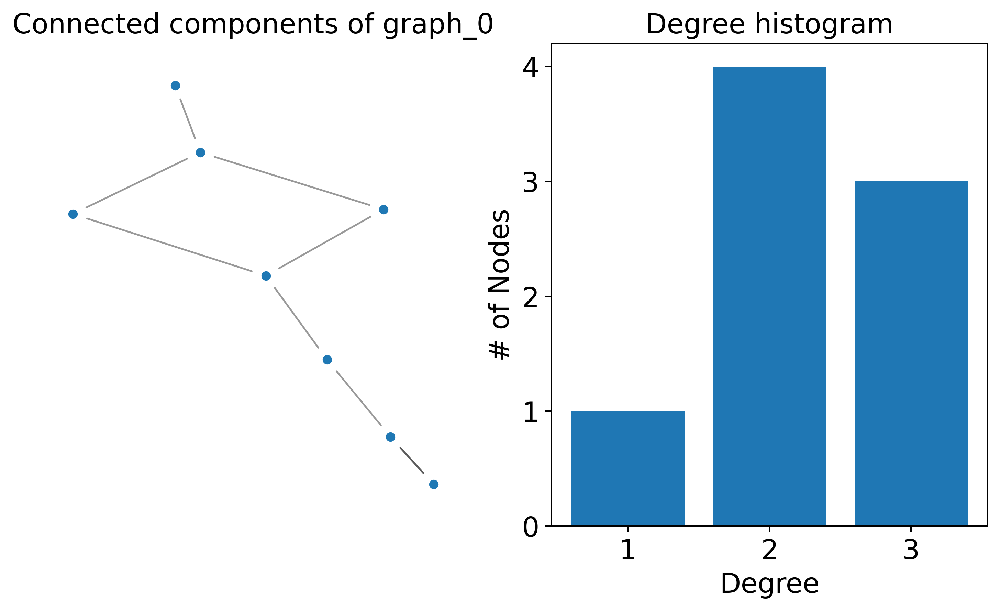
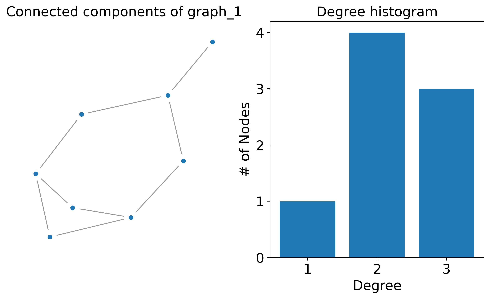
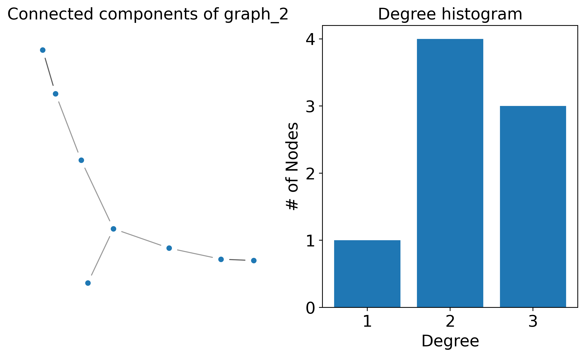

Summarising graphs
==================

In this simple script, I show that how to use NetworkX layouts to visualise
graphs.

We define a function for this:

.. testcode:: recipe8-test
    :hide:

    import logging
    import pathlib

    import matplotlib.pyplot as plt
    import networkx as nx
    import numpy as np
    import stk

    import cgexplore as cgx

    logger = logging.getLogger(__name__)

    # Define working directories.
    wd = pathlib.Path.cwd() / "source"/ "recipes" / "recipe_8_output"
    figure_dir = wd / "figures"

.. testcode:: recipe8-test

    def summarise_topology_code(
        topology_code: cgx.scram.TopologyCode,
        name: str,
        figure_dir: pathlib.Path,
    ) -> None:
        """Use networkx to layout and summarise a graph."""
        g = topology_code.get_nx_graph()
        degree_sequence = sorted((d for n, d in g.degree()), reverse=True)

        fig = plt.figure(figsize=(8, 5))
        # Create a gridspec for adding subplots of different sizes
        axgrid = fig.add_gridspec(1, 2)

        ax0 = fig.add_subplot(axgrid[:, :1])
        gcc = g.subgraph(
            sorted(nx.connected_components(g), key=len, reverse=True)[0]
        )
        pos = nx.spring_layout(gcc, seed=10396953)
        nx.draw_networkx_nodes(gcc, pos, ax=ax0, node_size=20)
        nx.draw_networkx_edges(gcc, pos, ax=ax0, alpha=0.4)
        ax0.tick_params(axis="both", which="major", labelsize=16)
        ax0.set_title(f"Connected components of {name}", fontsize=16)
        ax0.set_axis_off()

        ax2 = fig.add_subplot(axgrid[:, 1:])
        ax2.bar(*np.unique(degree_sequence, return_counts=True))
        ax2.tick_params(axis="both", which="major", labelsize=16)
        ax2.set_title("Degree histogram", fontsize=16)
        ax2.set_xlabel("Degree", fontsize=16)
        ax2.set_ylabel("# of Nodes", fontsize=16)

        fig.tight_layout()
        # Uncomment to save figure!
        # fig.savefig(
        #     figure_dir / f"g_{name}.png",
        #     dpi=360,
        #     bbox_inches="tight",
        # )
        plt.close()

Then, we can build any building block system and iterate through the possible
graphs, producing these plots.

.. testcode:: recipe8-test

    bbs = {
        1: stk.BuildingBlock("BrC", (stk.BromoFactory(),)),
        2: stk.BuildingBlock("BrCCCCBr", (stk.BromoFactory(),)),
        3: stk.BuildingBlock("BrCC(Br)CCBr", (stk.BromoFactory(),)),
    }

    system = {bbs[3]: 3, bbs[2]: 4, bbs[1]: 1}

    iterator = cgx.scram.TopologyIterator(building_block_counts=system)

    for tc in iterator.yield_graphs():
        summarise_topology_code(
            topology_code=tc,
            name=f"graph_{tc.idx}",
            figure_dir=figure_dir,
        )

.. raw:: html

    <a class="btn-download" href="../_static/recipes/recipe_8.py" download>⬇️ Download Python Script</a>
